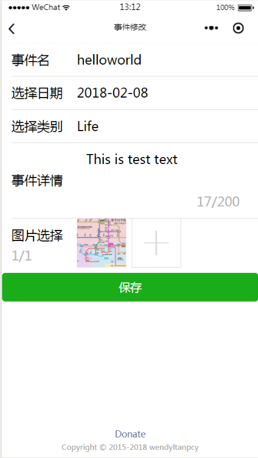

# filmNPad
一款带有影片查询功能的记事本应用

## 使用api

猫眼，聚合数据

## 简介
我的微信小程序的hello_world程序，此程序没有使用后台服务器。所有数据均直接请求得

## 引用的ui

- [weui](https://github.com/Tencent/weui-wxss)
- [zan-ui](https://github.com/youzan/zanui-weapp)

## 主要界面

### 记事本

### 影讯

### 记事本
+ 增加新事件
+ 事件查看
+ 删除事件
+ 事件编辑

### 电影区
+ 影片查询
+ 最新影片
    + 影片详情及预览
+ 附近影院
    + 影片场次
    + 选座预览（没有做出定票功能）

## License
MIT

